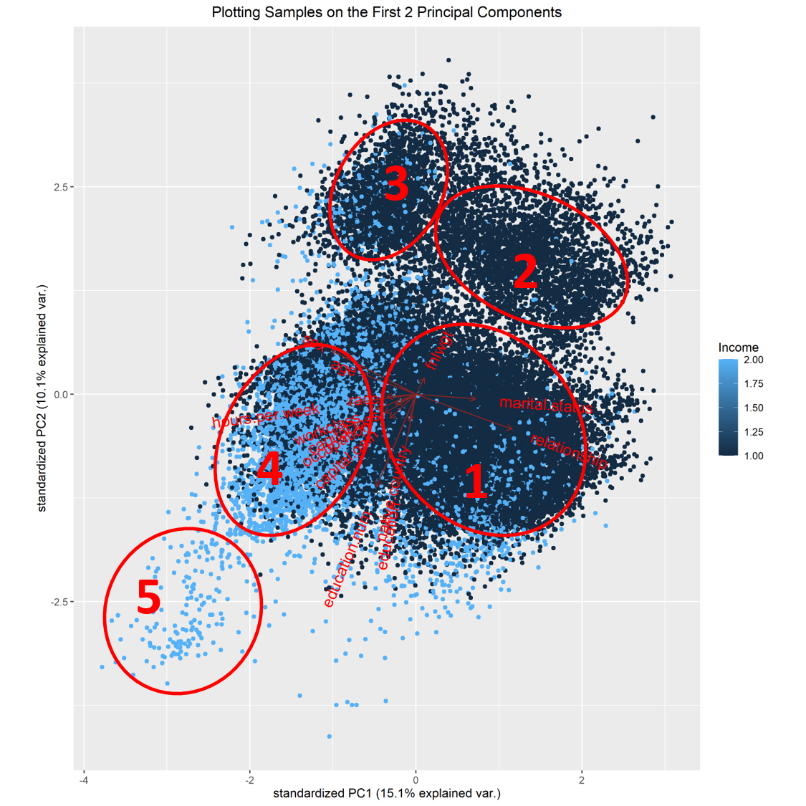
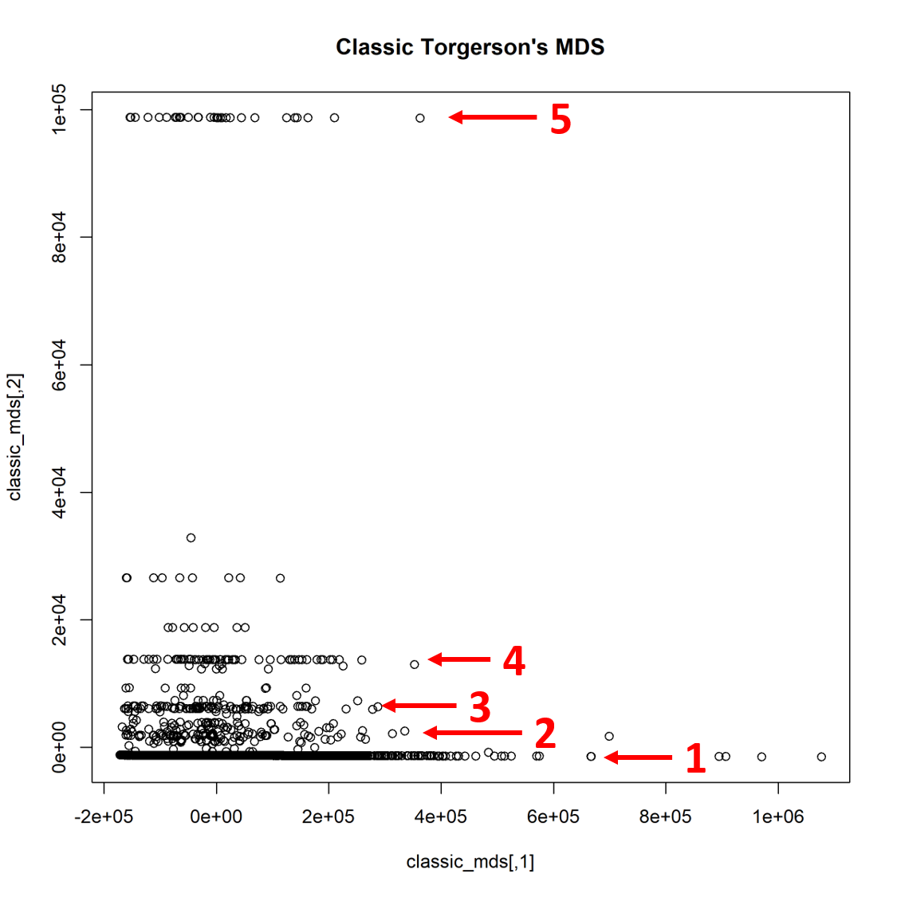

```{r setup, include=FALSE}

knitr::opts_chunk$set(echo = TRUE)
knitr::opts_chunk$set(message = FALSE)
knitr::opts_chunk$set(results = 'hold')
# knitr::opts_chunk$set(cache=TRUE)
knitr::opts_chunk$set(tidy.opts=list(width.cutoff=80), tidy=TRUE)
```

# Introduction

In this report, we analyze the [U.S. Census Bureau Income Dataset](https://code.datasciencedojo.com/datasciencedojo/datasets/tree/master/Census%20Income) taken from Data Science Dojo [@RebeccaMerrett2019].

This dataset was chosen because it has a large number of datapoints, 14 different variables, 2 labels with the possibility of having more than 2 clusters, and because of a personal interest in how various factors might affect the average income of an American citizen. 

We first conduct a preliminery analysis where we try to find more information about the raw data, such as the data types of the various variables and the number of unique values they contain. Then, we perform both Principal Component Analysis (PCA) and multiple versions of Multidimensional scaling (MDS) to try and visualize our dataset on 2 dimensions. Following this, we perform multiple hierarchical clusterings and k-means clusterings to try and find the possible clusters within the dataset. While the labels tell us there are 2, we feel this might be a generalization given the 48,842 datapoints, and strive to see if more good clusters can be formed. Finally, we perform evaluations on the the formed clusters to test their stability and internal and external validity.

Towards the end of the report, we discuss and analyze our results and give a brief conclusion of our findings.


# Data

In this dataset, the US Census Bureau surveyed 48,842 people and recorded 15 attributes including their ages, working class, years of education, and income, among other things. This dataset in its current form was compiled by Ronny Kohavi [@Kohavi1996] and is designed to be used for training and testing various classifiers, with 14 attributes as features and the last attribute, income level, as the class, being either above or below $50,000 USD (50K).

This dataset has been previously used for various statistical analysis purposes, such as clustering aggregation [@Gionis2007], anomaly detection [@Pelleg2004], and mining emerging patterns [@Bailey2002].

This dataset contains files for both training and testing datasets. We will perform preliminary analysis on both, perform PCA on the combined dataset, and perform MDS on only 5000 samples, taken as such that their class division matches the combined dataset population's division. This last one is due to the limitations of the computer being used and is subject to change for the final report.

## Preliminary Analysis

```{r}
# All the Libraries we need
library("knitr")
library(plyr)
library(dplyr)
library(ggbiplot)
library(smacof)
library(MASS)
library(cluster)
library(purrr)
library(dendextend)
library(factoextra)
library(cluster) # For k-medoid
library(kohonen) # SOM
# For Validation
library(fpc)
library(clValid)
library(mclust)
library(NbClust)
# For nonlinear projection
library(umap)
library(Rtsne)

```

### Reading the Data

We first load the datasets. Table 1 and Table \@ref(tab:Train-peek) show us the a peek inside the train dataset (the test dataset is of the same form). 

```{r Train-peek, tidy=FALSE}

census_train <- read.csv("../Data/census/adult.data.csv", header=TRUE, sep = ",")
census_test <- read.csv("../Data/census/adult.test.csv", header=TRUE, sep = ",")


kable(census_train[0:8,0:7], align = "l", row.names = TRUE,
      caption = "The First 7 Columns.", booktabs = T)
kable(census_train[0:8,8:15], align = "l", row.names = TRUE,
      caption = "The Remaining 8 Columns.", booktabs = T)

```


### Determining Basic Properties

Now let us find the number of samples for the test and train datasets and the number of features for each sample.

```{r}
samples_train <- nrow(census_train)
features_train <- ncol(census_train)

samples_test <- nrow(census_test)
features_test <- ncol(census_test)

sprintf(paste0("The total number of samples in the training set is %s and the number of ",
               "features is %s."), samples_train, features_train)
sprintf(paste0("The total number of samples in the test set is %s and the number of ",
               "features is %s."), samples_test, features_test)
```

However, this dataset contains one column for its classes, the "income" column. Thus, in essence, there are __14 features and 2 classes__.

### Determining the Number of Unique Values

__Training Set__ 

First, we will find the number of unique values in each column for the Training set.

```{r message = FALSE}


census_train %>% summarise_all(n_distinct)
```

Let us see if our dataset is imbalanced.
```{r}
census_train %>% group_by(income) %>% summarize(count=n())
```

As we can see, there are almost __3 times more "<=50K" classes then there are ">50K" classes__ (3.15 times, to be precise).

__Test Set__

Now we will find the number of unique values in each column for the Test set.

```{r message = FALSE}
census_test %>% summarise_all(n_distinct)
```

Let's see if the test set is imbalanced as well.
```{r}
census_test %>% group_by(income) %>% summarize(count=n())
```

Once again, there are almost __3 times more "<=50K" classes then there are ">50K" classes__ (3.23 times, to be precise).

### Column Labels and Various Properties

Now let us summarize by __combining__ both the Train and Test datasets. Table \@ref(tab:combined-table) shows the range of all the values and Table 4 summarizes the learned properties so far.
```{r combined-table, tidy=FALSE}
census_total <- rbind(census_train, census_test)

#As a Sanity Check:

samples_total <- nrow(census_total)
features_total <- ncol(census_total)

sprintf(paste0("The number of samples in the total set is %s and the number of ",
               "features is %s."), samples_total, features_total)

census_total %>% summarise_all(n_distinct)

range <- data.frame(min=sapply(census_total,min),max=sapply(census_total,max))
kable(range, align = "l", row.names = TRUE,
      caption = "The Range of Values for all Features", booktabs = T)

# To see the unique classes in the final feature, "income".
vec <- as.vector(census_total['income'])
unique(vec)

```

Table: Column labels, their type, number of unique values, range (if applicable), and representation type for the combined dataset.

| Column Label   | Type                  | Unique Values (Range if Applicable) | Representation |
|----------------|-----------------------|-------------------------------------|----------------|
| age            | Discrete              | 73 (17 - 90)                        | Ratio          |
| workclass      | Qualitative           | 9                                   | Nominal        |
| fnlwgt         | Discrete              | 21648 (12285 - 1490400)             | Ratio          |
| education      | Qualitative           | 16                                  | Ordinal        |
| education-num  | Discrete              | 16 (1-16)                           | Ratio          |
| marital-status | Qualitative           | 7                                   | Nominal        |
| occupation     | Qualitative           | 15                                  | Nominal        |
| relationship   | Qualitative           | 6                                   | Nominal        |
| race           | Qualitative           | 5                                   | Nominal        |
| sex            | Qualitative           | 2                                   | Nominal        |
| capital-gain   | Discrete              | 119 (0 - 99999)                     | Ratio          |
| capital-loss   | Discrete              | 92 (0 - 4356)                       | Ratio          |
| hours-per-week | Discrete              | 94 (1 - 99)                         | Ratio          |
| native-country | Qualitative           | 42                                  | Nominal        |
| income         | Qualitative (Classes) | 2                                   | Ordinal        |


## Data Preparation

We will perform three different data preparations, one for PCA, one for MDS, and one for clustering.

__PCA__

First, we will turn our Data Frame into a numerical matrix. This process will apply a label encoding to our qualitative data. Table 5 and Table \@ref(tab:Data-matrix-orig) shows a sample of this matrix.
```{r Data-matrix-orig}
data_matrix_orig <- data.matrix(census_total)

kable(data_matrix_orig[0:8,0:7], align = "l", caption = "The First 7 Columns.", booktabs = T)
kable(data_matrix_orig[0:8,8:15], align = "l", caption = "The Remaining 8 Columns.", booktabs = T)

```

Finally, we will remove the last column as it is our "classes" column, i.e. income.

```{r}
data_matrix <- data_matrix_orig[,-c(15)]
```

__Data Cleaning__

```{r}
# Removing Missing Values
df_no_missing <- census_total[!(census_total$workclass==" ?" | 
                                  census_total$occupation==" ?" | 
                                  census_total$native.country ==" ?"),]
# Removing duplicate rows
data_frame_orig <- df_no_missing[!duplicated(df_no_missing), ]

#Removing Final Weight and Categorical Education
head(data_frame_orig, 5)

data_frame <- data_frame_orig

# Removing 2 superfluous variables
data_frame <- data_frame[,-c(3, 4)]
head(data_frame, 5)

frame_no_outlier <- data_frame
```


```{r}
# Interquartile Method for Outlier Removal
############ For Age

#find Q1, Q3, and interquartile range for values in column A
Q1 <- quantile(frame_no_outlier$age, .25)
Q3 <- quantile(frame_no_outlier$age, .75)
IQR <- IQR(frame_no_outlier$age)

#only keep rows in dataframe that have values within 1.5*IQR of Q1 and Q3
frame_no_outlier <- subset(frame_no_outlier, frame_no_outlier$age>= (Q1 - 1.5*IQR) & frame_no_outlier$age<= (Q3 + 1.5*IQR))

############# For Education

#find Q1, Q3, and interquartile range for values in column A
Q1 <- quantile(frame_no_outlier$education.num, .25)
Q3 <- quantile(frame_no_outlier$education.num, .75)
IQR <- IQR(frame_no_outlier$education.num)

#only keep rows in dataframe that have values within 1.5*IQR of Q1 and Q3
frame_no_outlier <- subset(frame_no_outlier, frame_no_outlier$education.num>= (Q1 - 1.5*IQR) & frame_no_outlier$education.num<= (Q3 + 1.5*IQR))

############# For capital gain

#find Q1, Q3, and interquartile range for values in column A
Q1 <- quantile(frame_no_outlier$capital.gain, .25)
Q3 <- quantile(frame_no_outlier$capital.gain, .75)
IQR <- IQR(frame_no_outlier$capital.gain)

#only keep rows in dataframe that have values within 1.5*IQR of Q1 and Q3
frame_no_outlier <- subset(frame_no_outlier, frame_no_outlier$capital.gain>= (Q1 - 1.5*IQR) & frame_no_outlier$capital.gain<= (Q3 + 1.5*IQR))

############# For capital loss

#find Q1, Q3, and interquartile range for values in column A
Q1 <- quantile(frame_no_outlier$capital.loss, .25)
Q3 <- quantile(frame_no_outlier$capital.loss, .75)
IQR <- IQR(frame_no_outlier$capital.loss)

#only keep rows in dataframe that have values within 1.5*IQR of Q1 and Q3
frame_no_outlier <- subset(frame_no_outlier, frame_no_outlier$capital.loss>= (Q1 - 1.5*IQR) & frame_no_outlier$capital.loss<= (Q3 + 1.5*IQR))

############# For hours per week

#find Q1, Q3, and interquartile range for values in column A
Q1 <- quantile(frame_no_outlier$hours.per.week, .25)
Q3 <- quantile(frame_no_outlier$hours.per.week, .75)
IQR <- IQR(frame_no_outlier$hours.per.week)

#only keep rows in dataframe that have values within 1.5*IQR of Q1 and Q3
frame_no_outlier <- subset(frame_no_outlier, frame_no_outlier$hours.per.week>= (Q1 - 1.5*IQR) & frame_no_outlier$hours.per.week<= (Q3 + 1.5*IQR))

# Remove the zeroed columns of income gain/loss

data_full_clean <- frame_no_outlier[,-c(9, 10)]

#view row and column count of new data frame
dim(data_full_clean)
head(data_full_clean, 2)
```


```{r}
#### SAMPLING

clean_sample <- data_full_clean %>% group_by(income) %>% sample_n(2500)

clean_sample %>% group_by(income) %>% summarize(count=n()) # Checking if above was done correctly.

```

```{r eval=FALSE, echo=TRUE}
# To save the selected sample dataset, for reproducibility.
# write.csv(temp ,'5000framev1.csv', row.names = FALSE, col.names = TRUE)
```

```{r}
# To read the sampled data

clean_sample <- read.csv("../Data/5000framev1.csv")
```

```{r}

head (clean_sample, 5)


sample <- scale(data.matrix(clean_sample))
```


```{r Boxplots}
# SCALED BOXPLOT
data_frame_box <- data_frame[,-c(13)]
data_full_clean_box <- data_full_clean[,-c(11)]
sample_box <- sample[,-c(11)]

par(mar= c(7, 4.1, 4.1, 2.1))

boxplot(scale(data.matrix(data_frame_box)), main = "Boxplot for the Original Dataset", las=2)

boxplot(scale(data.matrix(data_full_clean_box)), las=2, main = "Boxplot for the Original Dataset (Outliers Removed)")

boxplot(sample_box, las=2, main = "Boxplot for the Sampled Dataset (Outliers Removed)")

par(mar= c(5.1, 4.1, 4.1, 2.1))
```


__MDS__ 

Because many MDS algorithms are either $O(n^{3})$ or $O(n^{2})$, we will sample them according to their proportions for the "income" class. Using the combined dataset, we will remove rows with missing data (since we have an ample number of rows, we can afford to delete them) and duplicate data (certain MDS algorithms, such as Sammon's Non-Linear Mapping, do not work if there are 0s present in the distance matrix, so duplicate rows must be removed) and sample 5000 datapoints, making sure that the ratio of "<=50K" to ">50K" is 3.2:1, as averaged in Section 2.1.3. Finally, we will convert it into a data matrix and remove the "income" column, similar to what we did for PCA.

```{r Data-prep-mds, cache=TRUE, eval=FALSE}

####### ALREADY DONE ABOVE IN DATA CLEANING ########


# # Removing rows with missing values
# df_no_missing <- census_total[!(census_total$workclass==" ?" |
#                                   census_total$occupation==" ?" |
#                                   census_total$native.country ==" ?"),]
# # Removing duplicate rows
# df_no_dup = df_no_missing[!duplicated(df_no_missing), ]
# # Choosing Equal Number of datapoints from both classes.
# temp_df <- df_no_dup %>% group_by(income) %>% sample_n(100)
# # Removing the excess >50K class datapoints in order to make the sample
# # representative of the original dataset.
# sample_frame <-temp_df[1:(nrow(temp_df) - 70),]
#
# data_matrix_orig_mds <- data.matrix(sample_frame)
#
# data_matrix_mds <- data_matrix_orig_mds[,-c(15)]
# sample_number <- nrow(data_matrix_mds)
# print(paste0("The number of samples selected is: ", sample_number))

```

```{r}
# To Remove Class Labels

data_matrix_orig_mds <- sample
 
data_matrix_mds <- data_matrix_orig_mds[,-c(11)]
sample_number <- nrow(data_matrix_mds)
print(paste0("The number of samples selected is: ", sample_number))

```

__Clustering__ 

For clustering, the data preparation is similar to MDS's data preparation. In addition, because some of the clustering algorithms use pseudorandom numbers, we will set a seed for reproducibility. Finally, we scale the dataset as an additional step in order to get a more accurate clustering.

```{r Data-prep-clus, cache=TRUE}
#Same pre-processing

data_matrix_clus <- data_matrix_orig_mds[,-c(11)]

sample_number <- nrow(data_matrix_clus)
print(paste0("The number of samples selected is: ", sample_number))

# Setting Seed to allow reproducible results
set.seed(786) # Setting Seed

data_matrix_scaled <- data_matrix_clus # It's already scaled.
```


# Methods

__PCA and MDS__

We first apply Principal Component Analysis (PCA) and 4 different Multidimensional Scaling (MDS) algorithms to better visualize our dataset. For PCA, two online tutorials were used to get experience with properly coding PCA in R [@LukeHayden2018; @AaronSchlegel2017]. In addition, Scree Plots will be plotted in order to to get a better understanding of the PCA. For MDS, Classical multidimensional scaling of a data matrix, Sammon's Non-Linear Mapping, Kruskal's Non-metric Multidimensional Scaling, and Symmetric Smacof was used, with another online tutorial being used as a general practical guide [@GastonSanchez2013].

For the criterion function, Sammon's Non-Linear Mapping uses:

$$J_{\text{samm}} = \frac{1}{\sum_{i<j} \delta_{ij}} \sum_{i<j}\frac{(d_{ij} - \delta_{ij} )^2}{\delta_{ij}}$$
which provides a good compromise between emphasizing large errors and large fractional errors. In comparison, 

Kruskal's Non-metric Multidimensional Scaling criterion function is:

$$J_{\text{kruskal}} = \sqrt{\frac{\sum_{i<j}(d_{ij} - \delta_{ij} )^2}{\sum_{i<j}\delta_{ij}^2}} $$
which emphasizes larger errors.

__Clustering__

For clustering, hierarchical and k-means clustering is performed.

For hierarchical clustering, we perform Agglomerative Nesting (AGNES) hierarchical clustering with 6 different linkages and Divisive Analysis (DIANA) clustering. Two online tutorials were used to get a better understanding of the functions [@PerceptiveAnalytics2017] [@ManishPathak2018].

For AGNES, we use the agnes() function over the hclust() function because it also outputs an agglomerative coefficient, which measures how strong the clustering structure is, with values closer to 1 being better. In addition, it uses fewer shortcuts when updating the distance matrix, such as calculating the distance between observations and clusters as averages of the distances between all the observations in 2 clusters, rather than just using two observations that were recently merged (as in hclust) [@Berkeley2011].

In addition, we use 6 different linkages: Group Average, single-link (MIN), complete-link (MAX), Ward's method, weighted (Unweighted Pair Group Method with Arithmetic Mean, UPGMA), and Generalized Average (Flexible UPGMA). All of these behave slightly differently and will not only allow us to see which method helps us better cluster our dataset, but will also help us learn more about our dataset by understanding why a particular method worked better. We will compare all of their agglomerative coefficients and choose the best 2 as a basis for our k-means clustering, to use as initialization. We will also use DIANA as well, which instead has a divisive coefficient, and consider it as a basis for k-means clustering too. In all 7 of these cases, we will tentatively make the cutoff at 5 clusters, based on our PCA clustering suggestion, and 2 clusters, in order to compare with the original dataset's 2 classes. Finally, dendrogram will be drawn for all the cases in order to get a batter visualization of the hierarchical clustering.

For k-means clustering, we first try to estimate the number of clusters, k, to select and additionally use k = 2 (original dataset clustering) and k = 5 (estimated clustering from PCA). An online tutorial was used to get a better understanding of how to implement related functions [@BradleyBoehmke2017] and the documentation was used to understand the various options [@R-core2016].

To estimate the number of clusters, we use two methods. First, the elbow method, which plots the Total Within Sum of Squares (WSS) against different number of clusters to see if an "elbow" forms, where the error drastically falls. And second, we use the silhouette method, which plots the average silhouette width vs. different number of clusters, with a silhouette being the value of how well each object lies within its cluster.

For each of the estimated clusters and for k = 2 and k = 5, we will randomly initialize k-means clustering 100 times each and find the clustering with the best results. The multiple random initialization is automatically done using the kmeans() function. Then, using the results of the hierarchical clustering, we will find 6 more k-means clusterings (k = 2 and k = 5 for the top 2 linkages and DIANA) using the hierarchical clustering centers as initialization points. Finally, we perform another PCA and project all the clusterings onto the first 2 principal components.

__Validation of Clusterings__

To validate our clusterings, we use various stability, internal, and external validation tests. For stability and internal, an online tutorial [@KasiaKulma2017] was used to better learn the functions. Similarly, the function for external validation was learned from another online tutorial [@STHDA2015].

For stability tests, we perform the nonparametric bootstrap, Average Proportion of Non-overlap (APN), Average Distance (AD), Average Distance between Means (ADM), and Figure Of Merit (FOM) stability tests.

The nonparametric boostrap method uses the model we have already fitted to our dataset (the cluster model) to generate more samples with the same distribution as the real data, with the "nonparametric" version making no assumption about how the data is distributed. It then uses this simulated data to calculate standard errors, construct confidence intervals, and perform hypothesis testing in what is known as "bootstrapping" [@CosmaShalizi2011]. Using the clusterboot() function, we receive a clusterwise Jaccard bootstrap mean, with larger values being better, the number of dissolved clusters, with smaller values being better, and the number of recovered clusters, with values close to the number of bootstrap repetitions chosen being better.

APN values are within the interval $[0, 1]$, with values closer to 0 indicating consistent clustering results. It measures the average proportion of datapoints that are not placed in the same cluster. AD, ADM, and FOM all have ranges from $[0, \infty]$, with smaller values being preferred. AD measures the average distance between datapoints within the same cluster. ADM measures the average distance between cluster centers for datapoints within the same cluster, with our implementation using Euclidean distance as the distance measure. Finally, FOM measures the average intra-cluster variance of datapoints in a deleted row, where the clustering is based on the remaining datapoints [@Brock2020].

For internal validation, we perform the Connectivity, Silhouette Width, and Dunn Index validation tests. Connectivity measures the extent to which datapoints are placed within the same cluster as their nearest neighbor. Its values range from $[0, \infty]$, with smaller values being preferred. The Silhouette Width is a non-inear combination measurement of the compactness and separation of the clusters. It averages each datapoint's Silhouette value, which measures the degree of confidence of that datapoints assignment to its particular cluster, and has values within the range of $[-1, 1]$, with values closer to 1 being better. Finally, the Dunn Index is also a non-linear combination measurement of the compactness and separation of the clusters, but it takes the ratio of the smallest distance between datapoints in different clusters to the largest intra-cluster distance. It has values in the range of $[0, \infty]$, with larger values being better.

Finally, for external validation, we choose size 2 clusters, k = 2, to match the 2 classes in the original dataset and compute the Rand Index. The Rand Index measures the agreement between two clusterings which, in our case, is the original cluster labels and our k=2 clusters. We use a corrected version which measures the same similarity, adjusted for chance, with a range from -1 (no agreement between the clusters) to +1 (a perfect agreement) [@STHDA2015].

# Code and Results


## Principal Component Analysis

First, let us calculate the covariance matrix. Table \@ref(tab:cov-matrix) shows a subsample of this matrix.

```{r cov-matrix, tidy=FALSE }
cov_matrix<- cov(data_matrix)

kable(cov_matrix[0:5,0:5], align = "l", row.names = TRUE,
      caption = "Covariance Matrix for the First 5 Features",
      booktabs = T)
```


Now, we will find the Eigenvectors and corresponding Eigenvalues of the Covariance Matrix

```{r}

eigen_info <- eigen(cov_matrix)
eigen_info

```

We can see that the Eigenvalues are decreasing and that the first 3 Eigenvalues are considerably larger than the rest. We can predict that the PCA will give us decent results and some structure to visualize. 

Finally, we apply PCA,

```{r}

pca_data <- prcomp(data_matrix, center = TRUE, scale. = TRUE, retx = TRUE)

```
show its summary,
```{r}
summary(pca_data)
```

and give general output of the PCA.

```{r}
pca_data
```


Let us generate a Scree Plot to better visualize the proportion of variance for each principal component. Figure \@ref(fig:screeplot) shows this scree plot.


```{r screeplot, fig.cap="Scree Plot of the Principal Components."}
plot(pca_data$sdev ^2, xlab="Principal Component", ylab="Proportion of Variance",
     type='b', las=1, main = "Scree Plot")

```

While that gives us a sense of how much greater the first principal component's proportion of variance is, it might be helpful to see it normalized to get a better perspective. Figure \@ref(fig:screeplot-norm) shows the normalized scree plot. 

```{r screeplot-norm, fig.cap="Scree Plot of the Principal Components, normalized."}
pca_data_sdev2 <- pca_data$sdev ^ 2 #Compute Variance
pca_data_normalized <- pca_data_sdev2/sum(pca_data_sdev2) #Compute Proportion of Variance
plot(pca_data_normalized,xlab="Principal Component", ylab="Proportion of Variance",
ylim=c(0,1), type='b', las=1, main = "Normalized Scree Plot")

axis(2,at=c(0.1, 0.3, 0.5, 0.7, 0.9), las=1) # To add additional ticks

```


Finally, we will use a modified ggbiplot to plot the first 2 principal components, shown in Figure \@ref(fig:biplot). The modified function components are listed in the appendix. 

```{r biplot, tidy=FALSE, fig.height=10, fig.width=10, fig.cap="Plotting all the datapoints on the first 2 Principal Components."}


#I created a function, my_ggbiplot, to edit the color scheme of the ggbiplot:
source("../my_functions.R")

pca_plot<-my_ggbiplot(pca_data, var.axes=TRUE, groups = data_matrix_orig[,c(15)])

# To make the arrows more visible

# pca_plot$layers
pca_plot$layers <- c(pca_plot$layers, pca_plot$layers[[1]])
# pca_plot$layers
pca_plot + 
  labs(color="Income", # Labeling the Legend
       title = "Plotting Datapoints on the First 2 Principal Components") +
  theme(plot.title = element_text(hjust = 0.5),
                     plot.caption=element_text(hjust = 0))


```

```{r eval=FALSE, echo=FALSE}
#Code to save the figure so I can annotate it:
png("PCA.png", units="in", width=10, height=10, res=300)
pca_plot + 
  labs(color="Income", # Labeling the Legend
       title = "Plotting Samples on the First 2 Principal Components") +
  theme(plot.title = element_text(hjust = 0.5))
dev.off()
```

Before we continue, let us redo the above steps for our smaller, sampled dataset which is used for MDS and clustering, to get a better perspective on it. The PCA summary is shown below, the normalized Scree Plot is shown in Figure \@ref(fig:PCA-scree), and plot of the first 2 principal components is shown in Figure \@ref(fig:PCA-sample).

```{r PCA-scree, tidy=FALSE, fig.cap="Scree Plot of the Principal Components using the sampled data, normalized." }
pca_data <- prcomp(data_matrix_mds, center = TRUE, scale. = TRUE, retx = TRUE)

summary(pca_data)

# Plotting Normalized Scree Plot
pca_data_sdev2 <- pca_data$sdev ^ 2 #Compute Variance
pca_data_normalized <- pca_data_sdev2/sum(pca_data_sdev2) #Compute Proportion of Variance
plot(pca_data_normalized,xlab="Principal Component", ylab="Proportion of Variance",
ylim=c(0,1), type='b', las=1, main = "Normalized Scree Plot for the Sampled Data")
axis(2,at=c(0.1, 0.3, 0.5, 0.7, 0.9), las=1) # To add additional ticks
```

```{r PCA-sample, tidy=FALSE, fig.height=10, fig.width=10, fig.cap="Plot of the first 2 principal components using our sampled data."}
# Plotting the first 2 principal components
pca_plot<-my_ggbiplot(pca_data, var.axes=TRUE, groups = clean_sample[,c(11)])

# To make the arrows more visible
pca_plot$layers <- c(pca_plot$layers, pca_plot$layers[[1]])

pca_plot + 
  labs(color="Income", # Labeling the Legend
  title = "Plotting Samples on the First 2 Principal Components for the Sampled Data") +
  theme(plot.title = element_text(hjust = 0.5), plot.caption=element_text(hjust = 0))
```


## Multidimensional Scaling


We will perform our 4 MDS processes on the distance matrix, generated from the sampled dataset. Table \@ref(tab:dist-matrix) shows a sample of the distance matrix.

```{r cache=TRUE}
dist_matrix <- dist(data_matrix_mds, method="euclidean")
```

```{r dist-matrix, tidy=FALSE}
dist_matrix_display <- as.matrix(dist_matrix)

kable(dist_matrix_display[0:8,0:8], align = "l", row.names = TRUE,
      caption = "Distance Matrix for the First 8 Features",
      booktabs = T)

```


### Classical Multidimensional Scaling

Figure \@ref(fig:classic-MDS) shows the classic MDS applied on the distance matrix.

```{r Classic, cache=TRUE}
classic_mds <- cmdscale(dist_matrix, k = 2)
```

```{r classic-MDS,  fig.cap="Plot of Classic Torgerson’s Metric MDS applied on the distance matrix."}
plot(classic_mds, main = "Classic Torgerson's MDS")
```

```{r eval=FALSE, echo=FALSE}
#Code to save the figure so I can annotate it:
png("Classic_MDS.png", units="in", width=8, height=8, res=300)
plot(classic_mds, main = "Classic Torgerson's MDS")
dev.off()
```

### Sammon’s Non-Linear Mapping

We apply Sammon’s Non-Linear Mapping using 11 different initializations: using the Classical MDS as an initialization and 10 random initializations. For the random initializations, we show the stress and plot of the best initialization.

Figure \@ref(fig:Sammon-classic) shows the Sammon’s Non-Linear Mapping with Classic MDS as the initialization.

```{r Sammon-process, cache=TRUE}

samm_mds_classic <- sammon(dist_matrix, y = classic_mds, k=2, niter = 50 )

```
```{r Sammon-classic, tidy=FALSE, fig.cap="Plot of Sammon's non-linear mapping using classic MDS as the initialization."}

print(paste0("Stress when using Classic_mds as initialization: ",
             samm_mds_classic$stress))
plot(samm_mds_classic$points,
     xlab="Samm_mds[,1]",
     ylab="Samm_mds[,2]",
     main = paste0("Sammon's MDS Mapping (Classic MDS as Initialization)")
     )
```


We now find Sammon's Non-Linear Mapping with 10 random initializations.

```{r Sammon-loop,  cache=TRUE, tidy=FALSE}

min_stress_samm <- .Machine$double.xmax # Largest double value the computer can store

for(i in 1:10) {
  print(paste0("Iteration Number ", i,":"), i)
  rand_init <- matrix(rnorm(sample_number*2, 0, 100000), nrow = sample_number, ncol = 2)
  samm_mds <- sammon(dist_matrix, rand_init, k=2, niter = 50 )

  if (samm_mds$stress < min_stress_samm){
    best_samm_mds <- samm_mds
    min_stress_samm <- samm_mds$stress
    best_samm_i <- i
  }
}
```

The best random initialization's stress and iteration number are shown below, while its plot is shown in Figure \@ref(fig:Sammon-random).

```{r Sammon-random, tidy=FALSE, fig.cap="Plot of Sammon's non-linear mapping using the best found random initialization."}

print(paste0("Best Initialization's iteration number : ", best_samm_i))
print(paste0("Best Initialization's Stress: ", best_samm_mds$stress))

plot(best_samm_mds$points,
         xlab="Best Random initialization's Samm_mds[,1]",
         ylab="Best Random Initialization's Samm_mds[,2]",
         main = paste0("Sammon's MDS Mapping (Best Random Initialization)"))
```

### Kruskal’s Non-metric Multidimensional Scaling

We apply Kruskal’s Non-metric Multidimensional Scaling using 11 different initializations: using the Classical MDS as an initialization and 10 random initializations. For the random initializations, we show the stress and plot of the best initialization.

Figure \@ref(fig:Kruskal-classic) shows the Kruskal’s Non-metric MDS with Classic MDS as the initialization.

```{r Kruskal-process, cache=TRUE }

kruskal_mds_classic <- isoMDS(dist_matrix, y = classic_mds, k=2, maxit = 10 )

```
```{r Kruskal-classic, fig.cap="Plot of Kruskal's non-linear mapping using classic MDS as initialization."}
print(paste0("Stress when using classic_mds as initialization: ",
             kruskal_mds_classic$stress))
plot(kruskal_mds_classic$points,
     xlab="kruskal_mds[,1]",
     ylab="kruskal_mds[,2]",
     main = paste0("Kruskal's MDS Mapping (Classic MDS as Initialization)")
     )
```

We now find Kruskal’s Non-metric MDS Mapping with 10 random initializations.

```{r Kruskal-loop, cache=TRUE, tidy=FALSE}

min_stress_kruskal <- .Machine$double.xmax # Largest double value the computer can store

for(i in 1:10) {
  print(paste0("Iteration Number ", i,":"), i)
  rand_init <- matrix(rnorm(sample_number*2, 0, 100000), nrow = sample_number, ncol = 2)
  kruskal_mds <- isoMDS(dist_matrix, rand_init, k=2, maxit = 10 )

  if (kruskal_mds$stress < min_stress_kruskal){
    best_kruskal_mds <- kruskal_mds
    min_stress_kruskal <- kruskal_mds$stress
    best_kruskal_i <- i
  }
}
```

The best random initialization's stress and iteration number are shown below, while its plot is shown in Figure \@ref(fig:Kruskal-random).

```{r Kruskal-random, tidy=FALSE, fig.cap="Plot of Kruskal’s Non-metric MDS mapping using the best found random initialization."}

print(paste0("Best Initialization's iteration number : ", best_kruskal_i))
print(paste0("Best Initialization's Stress: ", best_kruskal_mds$stress))

plot(best_kruskal_mds$points,
         xlab="Best Random initialization's kruskal_mds[,1]",
         ylab="Best Random Initialization's kruskal_mds[,2]",
         main = paste0("Kruskal's MDS Mapping (Best Random Initialization)"))
```

### Symmetric Smacof

We apply MDS on a symmetric dissimilarity (distance in our case) matrix using SMACOF with 11 different initializations: using the Classical MDS as an initialization and 10 random initializations. For the random initializations, we show the stress and plot of the best initialization.

Figure \@ref(fig:Smacof-classic) shows the Symmetric Smacof MDS with Classic MDS ("torgerson") as the initialization.

```{r Smacof-process, cache=TRUE }


smacof_mds_classic <- smacofSym(dist_matrix, ndim = 2, init = "torgerson", itmax = 1000 )

```
```{r Smacof-classic, tidy=FALSE, fig.cap="Plot of Symmetric Smacof non-linear mapping using classic MDS as initialization. "}
print(paste0("Stress when using torgerson's classic MDS as initialization: ",
             smacof_mds_classic$stress))

plot(smacof_mds_classic$conf,
     xlab="smacofSym_mds[,1]",
     ylab="smacofSym_mds[,2]",
     main = paste0("Symmetric Smacof MDS (Classic MDS as Initialization)")
     )
```

We now find the Symmetric Smacof MDS Mapping with 10 random initializations.

```{r Smacof-loop, cache=TRUE, tidy=FALSE}

min_stress_smacof <- .Machine$double.xmax # Largest double value the computer can store

for(i in 1:10) {
  print(paste0("Iteration Number ", i,":"), i)
  smacof_mds <- smacofSym(dist_matrix, ndim = 2, init = "random", itmax = 1000 )

  if (smacof_mds$stress < min_stress_smacof){
    best_smacof_mds <- smacof_mds
    min_stress_smacof <- smacof_mds$stress
    best_smacof_i <- i
  }
}
```

The best random initialization's stress and iteration number are shown below, while its plot is shown in Figure \@ref(fig:Smacof-random).

```{r Smacof-random, tidy=FALSE, fig.cap="Plot of Symmetric Smacof MDS mapping using the best found random initialization."}

print(paste0("Best Initialization's iteration number : ", best_smacof_i))
print(paste0("Best Initialization's Stress: ", best_smacof_mds$stress))

plot(best_smacof_mds$conf,
         xlab="Best Random initialization's smacofSym_mds[,1]",
         ylab="Best Random Initialization's smacofSym_mds[,2]",
         main = paste0("Symmetric Smacof MDS Mapping (Best Random Initialization)"))
```

## UMAP

Note: Details on UMAP were directly written on the Final Paper.

```{r}
head (data_matrix_mds, 3)
```

```{r UMAP-Param-Training, eval=FALSE}
# Hyperparameter tuning. Not included in the RMarkdown pdf, hence eval=FALSE. We did tuning durectly in RMarkdown.

min_dist_1 = seq(0.001,0.2,0.05)
min_dist_2 = seq(0.1,0.5,0.05)
min_dist = c(min_dist_1, min_dist_2)
c = 0
for (n_neig in seq(5,50,5)) { # 10 Iterations
  for (min_distance in min_dist) { # 13 Iterations
    UMAP_Data = umap(data_matrix, n_neighbors = n_neig, min_dist = min_distance)
    df = data.frame(X = UMAP_Data[,1],
                    Y = UMAP_Data[,2],
                    Labels = dataLabels)
    plot = ggplot(data = df, aes(x = X ,y = Y, col = Labels)) +
      geom_point()
    c = c + 1
    fileName = paste("ID",c,"N_N", n_neig, "M_D", min_distance,".png")
    png(fileName)
    print(plot)
    dev.off()
  }
}
```

```{r}
dataLabels = clean_sample[,11] %>%
  unlist %>%
  factor(labels = c("<=50K",">50K"))

sample_UMAP <- data.matrix(clean_sample)
sample_UMAP <- sample_UMAP[,-c(11)]

```


```{r UMAP, cache=TRUE}
UMAP_5000 = umap(sample_UMAP, n_neighbors = 30, min_dist = 0.15)
df = data.frame(X = UMAP_5000$layout[,1],
                Y = UMAP_5000$layout[,2],
                Labels = dataLabels)
```

```{r UMAP-Plot}
plot = ggplot(data = df, aes(x = X ,y = Y, col = Labels)) +
  geom_point() +
  ggtitle("UMAP Plot") +
  theme(plot.title = element_text(hjust = 0.5))

print (plot)
```

## TSNE

Note: Details on t-SNE were directly written on the Final Paper.

```{r TSNE-param-train, eval=FALSE}
# Hyperparameter tuning. Not included in the RMarkdown pdf, hence eval=FALSE. We did tuning durectly in RMarkdown

c = 0
for (per in seq(1,400,5)) { # 50 Iterations
  
    tSNE_Data = Rtsne(data_matrix,perplexity = per)
    df = data.frame(X = tSNE_Data$Y[,1],
                    Y = tSNE_Data$Y[,2],
                    Labels = dataLabels)
    plot = ggplot(data = df, aes(x = X ,y = Y, col = Labels)) +
      geom_point()
    c = c + 1
    fileName = paste("ID",c,"Perplexity", per,".png")
    png(fileName)
    print(plot)
    dev.off()
  
}
```


```{r TSNE, cache=TRUE}
tSNE_Data = Rtsne(sample_UMAP,perplexity = 81)
    df_tsne = data.frame(X = tSNE_Data$Y[,1],
                    Y = tSNE_Data$Y[,2],
                    Labels = dataLabels)
    
```

```{r TSNE-Plot}

plot_tsne = ggplot(data = df_tsne, aes(x = X ,y = Y, col = Labels)) +
  geom_point() +
  ggtitle("t-SNE Plot") +
  theme(plot.title = element_text(hjust = 0.5))

print (plot_tsne)

```


## Clustering

### Hierarchical Clustering


We first perform Agglomerative Nesting (AGNES) hierarchical clustering. We load all the necessary libraries, create our scaled distance matrix, and find hierarchical clusters for the 6 linkages, noting their agglomerative coefficients below. Figure \@ref(fig:Hier-link) shows the dendrograms for all the linkages. Then, we perform the Divisive Analysis (DIANA) clustering, show its divisive coefficient, and plot its dendrogram in Figure \@ref(fig:Hier-diana).

```{r Dist-matrix-scaled, cache=TRUE}

dist_matrix_scaled <- dist(data_matrix_scaled, method = "euclidean")

```

```{r Hier-clus, cache=TRUE}

hier_aver <- agnes(dist_matrix_scaled, method = "average")
hier_sing <- agnes(dist_matrix_scaled, method = "single")
hier_comp <- agnes(dist_matrix_scaled, method = "complete")
hier_ward <- agnes(dist_matrix_scaled, method = "ward")
hier_weig <- agnes(dist_matrix_scaled, method = "weighted")
hier_gave <- agnes(dist_matrix_scaled, method = "gaverage")

```

```{r}

m <- list( hier_aver, hier_sing, hier_comp, hier_ward, hier_weig, hier_gave)
names(m) <- c( "average", "single", "complete", "ward", "weighted", "gaverage")

ac <- function(x) {
  x$ac
}

print("The agglomerative coefficients for each of the 6 linkages are shown below:")
map_dbl(m, ac)
```


```{r Hier-link, fig.ncol = 2, out.width = "50%", fig.align = "center", fig.cap="Dendrogram of the 6 hierarchical clustering methods.", fig.subcap=c('Cluster Similarity: Group Average', 'Cluster Similarity: Single Link', 'Cluster Similarity: Complete Link', 'Cluster Similarity: Ward’s Method', 'Cluster Similarity: Weighted (UPGMA)', 'Cluster Similarity: Generalized Average (Flexible UPGMA)')}
pltree(hier_aver, cex = 0.6, hang = -1, main = 
         paste0("Dendrogram of AGNES (method = average)"))
pltree(hier_sing, cex = 0.6, hang = -1, main = 
         paste0("Dendrogram of AGNES (method = single)"))
pltree(hier_comp, cex = 0.6, hang = -1, main = 
         paste0("Dendrogram of AGNES (method = complete)"))
pltree(hier_ward, cex = 0.6, hang = -1, main = 
         paste0("Dendrogram of AGNES (method = ward)"))
pltree(hier_weig, cex = 0.6, hang = -1, main = 
         paste0("Dendrogram of AGNES (method = weighted)"))
pltree(hier_gave, cex = 0.6, hang = -1, main = 
         paste0("Dendrogram of AGNES (method = gaverage)"))

```


```{r Clus-Diana, cache=TRUE}

# For the divisive hierarchical clustering
hier_diana <- diana(dist_matrix_scaled)

```

```{r Hier-diana, fig.cap="Dendrogram of the Divisive Analysis clustering."}
# Divise coefficient
print(paste0("The divisive coefficient is: ", hier_diana$dc))

# Plotting
pltree(hier_diana, cex = 0.6, hang = -1, main = "Dendrogram of DIANA")

```

Given that the highest agglomerative coefficients are for the Ward's method and Generalized Average linkage, we will select their and DIANA's dendrogram and cut the tree to make 2 and 5 clusters, which we will use as initialization for k-means clustering. In addition, Figure \@ref(fig:dendro-colored) shows their colored dendrograms depicting these cluster choices. 

```{r Cut-Calc, cache=TRUE}

# Ward
cut_ward_2 <- cutree(hier_ward, k = 2)
cut_ward_5 <- cutree(hier_ward, k = 5)
#GAverage
cut_gave_2 <- cutree(hier_gave, k = 2)
cut_gave_5 <- cutree(hier_gave, k = 5)
#DIANA
cut_diana_2 <- cutree(hier_diana, k = 2)
cut_diana_5 <- cutree(hier_diana, k = 5)

```

```{r cache=TRUE}

# Ward
cluster_ward_2 <- aggregate(data_matrix_scaled,list(cluster=cut_ward_2),mean)
cluster_ward_2 <- cluster_ward_2[,-c(1)]

cluster_ward_5 <- aggregate(data_matrix_scaled,list(cluster=cut_ward_5),mean)
cluster_ward_5 <- cluster_ward_5[,-c(1)]

# GAverage
cluster_gave_2 <- aggregate(data_matrix_scaled,list(cluster=cut_gave_2),mean)
cluster_gave_2 <- cluster_gave_2[,-c(1)]

cluster_gave_5 <- aggregate(data_matrix_scaled,list(cluster=cut_gave_5),mean)
cluster_gave_5 <- cluster_gave_5[,-c(1)]

# DIANA
cluster_diana_2 <- aggregate(data_matrix_scaled,list(cluster=cut_diana_2),mean)
cluster_diana_2 <- cluster_diana_2[,-c(1)]

cluster_diana_5 <- aggregate(data_matrix_scaled,list(cluster=cut_diana_5),mean)
cluster_diana_5 <- cluster_diana_5[,-c(1)]

```

```{r dendro-colored, cache=TRUE, fig.ncol = 2, out.width = "50%", fig.align = "center", fig.cap="Dendrograms of the hierarchical clusterings using Ward's method, Generalized Average method, and Divisive Analysis (DIANA) clustering, colored to represent clusters of 2 (the original clustering) and 5 (predicted clustering from PCA).", fig.subcap=c('Ward\'s Method, Clustering = 2.', 'Ward\'s Method, Clustering = 5.', 'Generalized Average, Clustering = 2.', 'Generalized Average, Clustering = 5.', 'DIANA, Clustering = 2.', 'DIANA, Clustering = 5.')}

dend_obj_ward <- as.dendrogram(hier_ward)
dend_col_ward_2 <- color_branches(dend_obj_ward, k=2)
dend_col_ward_5 <- color_branches(dend_obj_ward, k=5)
plot(dend_col_ward_2, main = "Dendrogram (method = ward, k=2)")
plot(dend_col_ward_5, main = "Dendrogram (method = ward, k=5)")

dend_obj_gave <- as.dendrogram(hier_gave)
dend_col_gave_2 <- color_branches(dend_obj_gave, k=2)
dend_col_gave_5 <- color_branches(dend_obj_gave, k=5)
plot(dend_col_gave_2, main = "Dendrogram (method = gaverage, k=2)")
plot(dend_col_gave_5, main = "Dendrogram (method = gaverage, k=5)")

dend_obj_diana <- as.dendrogram(hier_diana)
dend_col_diana_2 <- color_branches(dend_obj_diana, k=2)
dend_col_diana_5 <- color_branches(dend_obj_diana, k=5)
plot(dend_col_diana_2, main = "Dendrogram (method = DIANA, k=2)")
plot(dend_col_diana_5, main = "Dendrogram (method = DIANA, k=5)")

```

### K-Means Clustering

First, we try to estimate the best number of clusters, k. Figure \@ref(fig:K-estimate-plot) shows the results of the elbow and silhouette methods. For the elbow method, there seems to be a small bend at k = 12. From the silhouette method, k = 2 seems to be the best choice.

```{r K-estimate, warning=FALSE, cache=TRUE}

elbow_wss <- fviz_nbclust(data_matrix_scaled, kmeans, method = "wss", k.max=40)
elbow_silho <- fviz_nbclust(data_matrix_scaled, kmeans, method = "silhouette", k.max=40)

```

```{r K-estimate-plot, fig.width=10, warning=FALSE,  fig.ncol = 2, out.width = "50%", fig.align = "center", fig.cap="Plots to help estimate the number of clusters, k, to select for k-means clustering, using the elbow method (a) and the silhouette method (b).", fig.subcap=c('Total Within Sum of Squares vs. different number of clusters.', 'Average silhouette width vs. different number of clusters.')}

# To plot the k-estimating plots.

elbow_wss

elbow_silho
```

Now, we perform k-means clustering with random initializations for our estimated k = 12 and k = 5, as well as k = 2 (the original clustering) and k = 4 (out of curiosity). In addition, we perform 6 additional k-means clustering using the clusters found from our hierarchical clustering results. Figure \@ref(fig:k-random) shows the best randomly initialized k-means clustering projected onto the first 2 principal components of a PCA, while Figure \@ref(fig:k-hierarchical) shows similar plots for the hierarchical clustering-initialized k-means clusters. Below, we also give the size of each of the clusters within each k-means clustering.

```{r K-means-clus, cache=TRUE, warning=FALSE}

k_clus_2 <- kmeans(data_matrix_scaled, centers = 2, nstart = 100)
k_clus_4 <- kmeans(data_matrix_scaled, centers = 4, nstart = 100)
k_clus_5 <- kmeans(data_matrix_scaled, centers = 5, nstart = 100)
k_clus_12 <- kmeans(data_matrix_scaled, centers = 12, nstart = 100)

```

```{r K-means-clus-custom, cache=TRUE}

k_clus_ward_2 <- kmeans(data_matrix_scaled, centers = cluster_ward_2)
k_clus_ward_5 <- kmeans(data_matrix_scaled, centers = cluster_ward_5)
k_clus_gave_2 <- kmeans(data_matrix_scaled, centers = cluster_gave_2)
k_clus_gave_5 <- kmeans(data_matrix_scaled, centers = cluster_gave_5)
k_clus_diana_2 <- kmeans(data_matrix_scaled, centers = cluster_diana_2)
k_clus_diana_5 <- kmeans(data_matrix_scaled, centers = cluster_diana_5)

```


```{r}

noquote("The size of the clusters for each of the k-means clusters are shown below:")
noquote("Randomly Initialized, k = 2:")
print(k_clus_2$size)
noquote("Randomly Initialized, k = 4:")
print(k_clus_4$size)
noquote("Randomly Initialized, k = 5:")
print(k_clus_5$size)
noquote("Randomly Initialized, k = 12:")
print(k_clus_12$size)

noquote("Ward's Method Initialized, k = 2:")
print(k_clus_ward_2$size)
noquote("Ward's Method Initialized, k = 5:")
print(k_clus_ward_5$size)
noquote("Generalized Averaged Method Initialized, k = 2:")
print(k_clus_gave_2$size)
noquote("Generalized Averaged Method Initialized, k = 5:")
print(k_clus_gave_5$size)
noquote("DIANA Method Initialized, k = 2:")
print(k_clus_diana_2$size)
noquote("DIANA Method Initialized, k = 5:")
print(k_clus_diana_5$size)

```

```{r k-random, cache=TRUE, fig.ncol = 2, out.width = "50%", fig.align = "center", fig.cap="Results of the k-means clustering for all 4 randomly initialized cluster options. A PCA was produced and the clusterings were projected onto the first 2 principal components in order to visualize them.", fig.subcap=c('k=2', 'k=4', 'k=5', 'k=12')}
fviz_cluster(k_clus_2, data = data_matrix_scaled)
fviz_cluster(k_clus_4, data = data_matrix_scaled)
fviz_cluster(k_clus_5, data = data_matrix_scaled)
fviz_cluster(k_clus_12, data = data_matrix_scaled)

```

```{r k-hierarchical, cache=TRUE, fig.ncol = 2, out.width = "50%", fig.align = "center", fig.cap="Results of the k-means clustering for all 6 hierarchical clustering-determined cluster options. A PCA was produced and the clusterings were projected onto the first 2 principal components in order to visualize them.", fig.subcap=c('Ward\'s Method, k=2', 'Ward\'s Method, k=5', 'Generalized Average Method, k=2', 'Generalized Average Method, k=5', 'DIANA Method, k=2', 'DIANA Method, k=5')}

fviz_cluster(k_clus_ward_2, data = data_matrix_scaled)
fviz_cluster(k_clus_ward_5, data = data_matrix_scaled)
fviz_cluster(k_clus_gave_2, data = data_matrix_scaled)
fviz_cluster(k_clus_gave_5, data = data_matrix_scaled)
fviz_cluster(k_clus_diana_2, data = data_matrix_scaled)
fviz_cluster(k_clus_diana_5, data = data_matrix_scaled)

```

## k-Medoids


```{r Clara, cache=TRUE}
clara_2 <- clara(data_matrix_clus, k=2, metric = "euclidean", stand = TRUE, samples = 1000, pamLike = TRUE)
clara_3 <- clara(data_matrix_clus, k=3, metric = "euclidean", stand = TRUE, samples = 1000, pamLike = TRUE)
clara_4 <- clara(data_matrix_clus, k=4, metric = "euclidean", stand = TRUE, samples = 1000, pamLike = TRUE)
clara_5 <- clara(data_matrix_clus, k=5, metric = "euclidean", stand = TRUE, samples = 1000, pamLike = TRUE)
clara_8 <- clara(data_matrix_clus, k=8, metric = "euclidean", stand = TRUE, samples = 1000, pamLike = TRUE)
clara_12 <- clara(data_matrix_clus, k=12, metric = "euclidean", stand = TRUE, samples = 1000, pamLike = TRUE)
```

```{r Clara-plots, cache=TRUE}
print (clara_2)
fviz_cluster(clara_2, data = data_matrix_clus)
fviz_cluster(clara_3, data = data_matrix_clus)
fviz_cluster(clara_4, data = data_matrix_clus)
fviz_cluster(clara_5, data = data_matrix_clus)
fviz_cluster(clara_8, data = data_matrix_clus)
fviz_cluster(clara_12, data = data_matrix_clus)
```

## Self-Organizing maps (SOM)

```{r SOM, cache=TRUE}
data_matrix_s <- data_matrix_clus
som_grid <- somgrid(xdim = 20, ydim = 20, topo = "hexagonal")
som_model <- som(data_matrix_s, 
                 grid=som_grid, 
                 rlen=200, 
                 keep.data = TRUE
                )
som_codebook = getCodes(som_model) 

#Training progress for SOM
plot(som_model, type="changes")
#Node count plot
plot(som_model, type="count", main="Node Counts")
# U-matrix visualisation
plot(som_model, type="dist.neighbours", main = "SOM neighbour distances")

k_clus_som_2 <- kmeans(scale(som_codebook), centers = 2, nstart = 500)
k_clus_som_4 <- kmeans(scale(som_codebook), centers = 4, nstart = 500)
k_clus_som_5 <- kmeans(scale(som_codebook), centers = 5, nstart = 500)
k_clus_som_12 <- kmeans(scale(som_codebook), centers = 12, nstart = 500)

```

```{r SOM-Plots}

plot(som_model, type="mapping", bgcol = k_clus_som_2$cluster, main = "Self-Organizing Map, k = 2")
plot(som_model, type="mapping", bgcol = k_clus_som_4$cluster, main = "Self-Organizing Map, k = 4")
plot(som_model, type="mapping", bgcol = k_clus_som_5$cluster, main = "Self-Organizing Map, k = 5")
plot(som_model, type="mapping", bgcol = k_clus_som_12$cluster, main = "Self-Organizing Map, k = 12")

```

## Validation of Clusterings

### Stability Testing

We first perform the nonparametric bootstrap test for our k-means clustering result for 100 bootstraps and k = 2, 4, 5, and 12 (the best options from the previous results). The results for each option are shown below.

```{r K-means-boot, tidy=FALSE, cache=TRUE, results="hide"}


k_clus_2_boot <- clusterboot(data_matrix_scaled, B=100, bootmethod="boot",
                        clustermethod=kmeansCBI,
                        krange=2, seed=786)

k_clus_4_boot <- clusterboot(data_matrix_scaled, B=100, bootmethod="boot",
                        clustermethod=kmeansCBI,
                        krange=4, seed=786)

k_clus_5_boot <- clusterboot(data_matrix_scaled, B=100, bootmethod="boot",
                        clustermethod=kmeansCBI,
                        krange=5, seed=786)

k_clus_12_boot <- clusterboot(data_matrix_scaled, B=100, bootmethod="boot",
                        clustermethod=kmeansCBI,
                        krange=12, seed=786)

```


### K-medoid
```{r Clara-boot, cache=TRUE, results="hide"}

clara_2_boot <- clusterboot(data_matrix_scaled, B=100, bootmethod="boot",
                        clustermethod=claraCBI,
                        k=2, seed=786)
clara_3_boot <- clusterboot(data_matrix_scaled, B=100, bootmethod="boot",
                        clustermethod=claraCBI,
                        k=3, seed=786)
clara_4_boot <- clusterboot(data_matrix_scaled, B=100, bootmethod="boot",
                        clustermethod=claraCBI,
                        k=4, seed=786)
clara_5_boot <- clusterboot(data_matrix_scaled, B=100, bootmethod="boot",
                        clustermethod=claraCBI,
                        k=5, seed=786)
clara_8_boot <- clusterboot(data_matrix_scaled, B=100, bootmethod="boot",
                        clustermethod=claraCBI,
                        k=8, seed=786)
clara_12_boot <- clusterboot(data_matrix_scaled, B=100, bootmethod="boot",
                        clustermethod=claraCBI,
                        k=12, seed=786)

```

__For k = 2__,
```{r}
print(k_clus_2_boot)
```

__For k = 4__,
```{r}
print(k_clus_4_boot)
```

__For k = 5__,
```{r}
print(k_clus_5_boot)
```

__For k = 12__,
```{r}
print(k_clus_12_boot)
```

__BOOTSTRAP FOR K-MEDOID__


__For k = 2__,
```{r}
print(clara_2_boot)
```

__For k = 4__,
```{r}
print(clara_4_boot)
```

__For k = 5__,
```{r}
print(clara_5_boot)
```

__For k = 12__,
```{r}
print(clara_12_boot)
```

Then, for APN, AD, ADM, and FOM, we use clValid(), which also conveniently does our internal validity tests as well. Below, we show the combined summary for APN, AD, ADM, FOM, and the internal validation measurements, Connectivity, Silhouette Width, and the Dunn Index. Figure \@ref(fig:Stability-plots) graphically shows the results of the APN, AD, ADM, and FOM measurements.

```{r Multi-valid-test, tidy=FALSE, cache=TRUE, warning=FALSE}

multi_valid_test <- clValid(data_matrix_scaled, c(2, 3, 4, 5, 8, 12),
                      clMethods = c("agnes", "diana", "kmeans", "clara", "som" ),
                      validation = c("internal", "stability"),
                      maxitems = 50000,
                      method = "ward"
)

```

```{r}
summary(multi_valid_test)
```

```{r Stability-plots, tidy=FALSE, fig.ncol = 2, out.width = "50%", fig.align = "center", fig.cap="Results of the stability validation tests for all the specified clustering methods and k values.", fig.subcap=c('')}

plot(multi_valid_test, measure=c("APN"), legend=FALSE, lwd = 3.5)
legend("bottomright", clusterMethods(multi_valid_test),col=1:5,
       lty=1:5, pch=paste(1:5), lwd = 3.5)

plot(multi_valid_test, measure=c("AD"), legend=FALSE, lwd = 3.5)
legend("bottomleft", clusterMethods(multi_valid_test), col=1:5,
       lty=1:5, pch=paste(1:5), lwd = 3.5)

plot(multi_valid_test, measure=c("ADM"), legend=FALSE, lwd = 3.5)
legend("bottomright", clusterMethods(multi_valid_test), col=1:5,
       lty=1:5, pch=paste(1:5), lwd = 3.5)

plot(multi_valid_test, measure=c("FOM"), legend=FALSE, lwd = 3.5)
legend("bottomleft", clusterMethods(multi_valid_test), col=1:5,
       lty=1:5, pch=paste(1:5), lwd = 3.5)

```

### Internal Validation

The results of the Connectivity, Silhouette Width, and the Dunn Index measurements were given above. Figure \@ref(fig:Internal-plots) graphically shows their results. In addition, since k = 2 seems to be best clustering option (which is also the original number of labels), we plot the Silhouette figures for all of our k = 2 clusterings, both hierarchical, Figure \@ref(fig:Hier-sil-plots), and k-means, Figure \@ref(fig:K-means-sil-plots). In addition, since k-means clustering with k = 12 was the best result for the AD and FOM measurements, we plot its Silhouette plot as well, in Figure \@ref(fig:K-means-12-sil-plot).

```{r Internal-plots, tidy=FALSE, fig.ncol = 2, out.width = "50%", fig.align = "center", fig.cap="Results of the Internal validation tests for all the specified clustering methods and k values.", fig.subcap=c('')}

plot(multi_valid_test, measure=c("Connectivity"), legend=FALSE, lwd = 3.5)
legend("topleft", clusterMethods(multi_valid_test), col=1:5, lty=1:5,
       pch=paste(1:5), lwd = 3.5)

plot(multi_valid_test, measure=c("Dunn"), legend=FALSE, lwd = 3.5)
legend("topright", clusterMethods(multi_valid_test), col=1:5, lty=1:5,
       pch=paste(1:5), lwd = 3.5)

plot(multi_valid_test, measure=c("Silhouette"), legend=FALSE, lwd = 3.5)
legend("topright", clusterMethods(multi_valid_test), col=1:5, lty=1:5,
       pch=paste(1:5), lwd = 3.5)


```


```{r Hier-sil-plots, tidy=FALSE, fig.ncol = 2, out.width = "50%", fig.align = "center", fig.cap="Silhouette plots of all the k = 2 hierarchical clusters we have generated.", fig.subcap=c('')}

# hierarchical

sil_heir_diana_2 <- silhouette(cut_diana_2, dist_matrix_scaled)
sil_heir_ward_2 <- silhouette(cut_ward_2, dist_matrix_scaled)
sil_heir_gave_2 <- silhouette(cut_gave_2, dist_matrix_scaled)

noquote("Cluster Sizes and Silhouette values for DIANA, Ward's Method, and ")
noquote("Generalized Average hierarchical clusterings, respectively:")

fviz_silhouette(sil_heir_diana_2, print.summary = TRUE,
                main ="Silhouette Plot (Hierarchical Clustering, DIANA, k = 2)")
fviz_silhouette(sil_heir_ward_2, print.summary = TRUE,
                main ="Silhouette Plot (Hierarchical Clustering, Ward's Method, k = 2)")
fviz_silhouette(sil_heir_gave_2, print.summary = TRUE,
                main ="Silhouette Plot (Hierarchical Clustering, Generalized Avg., k = 2)")

```

```{r K-means-sil-plots, tidy=FALSE, fig.ncol = 2, out.width = "50%", fig.align = "center", fig.cap="Silhouette plots of all the k = 2 k-means clusters we have generated.", fig.subcap=c('')}

# k-means

sil_k_rand_2 <- silhouette(k_clus_2$cluster, dist_matrix_scaled)
sil_k_ward_2 <- silhouette(k_clus_ward_2$cluster, dist_matrix_scaled)
sil_k_gave_2 <- silhouette(k_clus_gave_2$cluster, dist_matrix_scaled)
sil_k_diana_2 <- silhouette(k_clus_diana_2$cluster, dist_matrix_scaled)

noquote("Cluster Sizes and Silhouette values for the randomly initialized and Ward's")
noquote("Method, Generalized Average, and DIANA hierarchical clustering-initialized")
noquote("k-means clusters, respectively:")

fviz_silhouette(sil_k_rand_2, print.summary = TRUE,
                main ="Silhouette Plot (k-means Clustering, randomly initialized, k = 2)")
fviz_silhouette(sil_k_ward_2, print.summary = TRUE,
           main ="Silhouette Plot (k-means Clustering, Ward's Method initialized, k = 2)")
fviz_silhouette(sil_k_gave_2, print.summary = TRUE,
        main ="Silhouette Plot (k-means Clustering, Generalized Avg. initialized, k = 2)")
fviz_silhouette(sil_k_diana_2, print.summary = TRUE,
                main ="Silhouette Plot (k-means Clustering, DIANA initialized, k = 2)")

```

```{r K-means-12-sil-plot, tidy=FALSE, fig.align = "center", fig.cap="Silhouette plot for the randomly initialized k = 12 k-means cluster." }

sil_k_rand_12 <- silhouette(k_clus_12$cluster, dist_matrix_scaled)

noquote("Cluster Size and Silhouette value for the randomly initialized k-means cluster, k=12.")
fviz_silhouette(sil_k_rand_12, print.summary = TRUE,
               main ="Silhouette Plot (k-means Clustering, randomly initialized, k = 12)")

```

### External

Finally, we perform external validation and determine the Rand Index for all of our k = 2 clusterings. First, we setup our original label clustering:

```{r}

orig_cluster <- data.matrix(clean_sample)
orig_cluster <- orig_cluster[,c(11)]

sample_frame <- data.frame(sample)

```

Then we show the clustering size comparison with the original class size and the Rand Index for each k = 2 clustering, with a summary shown in Table 9:

__DIANA hierarchical clustering__:

```{r}

noquote("Cluster Size Comparison:")
table(sample_frame$income, cut_diana_2)
ext_stats_hier_diana_2 <- cluster.stats(d=dist_matrix_scaled, orig_cluster, cut_diana_2)
randInd_hier_diana_2 <- ext_stats_hier_diana_2$corrected.rand
print(paste0("Rand Index for DIANA Hierarchical Clustering: ", randInd_hier_diana_2))

```

__Ward's method hierarchical clustering__:

```{r, tidy=FALSE}

noquote("Cluster Size Comparison:")
table(sample_frame$income, cut_ward_2)
ext_stats_hier_ward_2 <- cluster.stats(d=dist_matrix_scaled, orig_cluster, cut_ward_2)
randInd_hier_ward_2 <- ext_stats_hier_ward_2$corrected.rand
print(paste0("Rand Index for Ward's Method Hierarchical Clustering: ",
             randInd_hier_ward_2))

```

__Generalized Average method hierarchical clustering__:

```{r, tidy=FALSE}

noquote("Cluster Size Comparison:")
table(sample_frame$income, cut_gave_2)
ext_stats_hier_gave_2 <- cluster.stats(d=dist_matrix_scaled, orig_cluster, cut_gave_2)
randInd_hier_gave_2 <- ext_stats_hier_gave_2$corrected.rand
print(paste0("Rand Index for GAveraged Method Hierarchical Clustering: ",
             randInd_hier_gave_2))

```


__k = 2, randomly initialized k-means clustering__:

```{r, tidy=FALSE}

noquote("Cluster Size Comparison:")
table(sample_frame$income, k_clus_2$cluster)
ext_stats_k_rand_2 <- cluster.stats(d=dist_matrix_scaled, orig_cluster, k_clus_2$cluster)
randInd_k_rand_2 <- ext_stats_k_rand_2$corrected.rand
print(paste0("Rand Index for the randomly initialized k-means clustering: ",
             randInd_k_rand_2))

```

__k = 2, Ward's Method hierarchical clustering-initialized k-means clustering__:

```{r, tidy=FALSE}

noquote("Cluster Size Comparison:")
table(sample_frame$income, k_clus_ward_2$cluster)
ext_stats_k_ward_2 <- cluster.stats(d=dist_matrix_scaled, orig_cluster,
                                    k_clus_ward_2$cluster)
randInd_k_ward_2 <- ext_stats_k_ward_2$corrected.rand
print(paste0("Rand Index the Ward's Method-initialized k-means clustering: ",
             randInd_k_ward_2))

```

__k = 2, Generalized Average hierarchical clustering-initialized k-means clustering__:

```{r, tidy=FALSE}

noquote("Cluster Size Comparison:")
table(sample_frame$income, k_clus_gave_2$cluster)
ext_stats_k_gave_2 <- cluster.stats(d=dist_matrix_scaled, orig_cluster,
                                    k_clus_gave_2$cluster)
randInd_k_gave_2 <- ext_stats_k_gave_2$corrected.rand
print(paste0("Rand Index the GAveraged-initialized k-means clustering: ", randInd_k_gave_2))

```

__k = 2, DIANA hierarchical clustering-initialized k-means clustering__:

```{r, tidy=FALSE}

noquote("Cluster Size Comparison:")
table(sample_frame$income, k_clus_diana_2$cluster)
ext_stats_k_diana_2 <- cluster.stats(d=dist_matrix_scaled, orig_cluster,
                                     k_clus_diana_2$cluster)
randInd_k_diana_2 <- ext_stats_k_diana_2$corrected.rand
print(paste0("Rand Index the DIANA-initialized k-means clustering: ", randInd_k_diana_2))

```

__k = 2, k-medoid clustering__:

```{r, tidy=FALSE}

noquote("Cluster Size Comparison:")
table(sample_frame$income, clara_2$cluster)
ext_stats_k_medoid_2 <- cluster.stats(d=dist_matrix_scaled, orig_cluster,
                                     clara_2$cluster)
randInd_k_medoid_2 <- ext_stats_k_medoid_2$corrected.rand
print(paste0("Rand Index for k-medoid clustering: ", randInd_k_medoid_2))

```


Table: Summary of all of the k = 2 clustering methods and their Rand Index when compared to the original labeling.

|              | Clustering     | Rand Index |
|--------------|----------------|------------|
| Hierarchical | DIANA          | 0.0003     |
|              | Ward's Method  | 0.0855     |
|              | GAveraged      | 0.0002     |
| k-means      | Random-Init    | 0.1009     |
|              | Ward-Init      | 0.1009     |
|              | GAveraged-Init | 0.0003     |
|              | DIANA-Init     | 0.0003     |
| k-medoids    |                | 0.0708     |

# Analysis and Evaluation of Results / Discussion

__NOTE__: This section is outdated. Please refer to the final paper for an up-to-date version that includes information gained from the nonlinear projections, k-medoid clustering, and k-means on SOM clustering.

## PCA

From the Eigenvalues, as we noted before, because they are decreasing and the first 3 eigenvalues are considerably larger than the rest, we predicted that the PCA will give us decent results and some structure to visualize.

Upon applying PCA, we saw from the Scree plots in Figures \@ref(fig:screeplot) and \@ref(fig:screeplot-norm) (as well as the summary(pca_data)) that it would take the first 8 principal components to encompass 70% of the cumulative variance. However, since our goal is to project them, we chose to focus on the first 2 components, which contain about 25% of the variance.

From Figure \@ref(fig:biplot), we can see the shape that the samples take when plotted across the first 2 principal components. From the arrows, we can understand that higher values in that variable causes a datapoint to go in the direction of the arrow on the PCA plot. This seemingly also works for categorical data such as “relationship” where a label of 6 (Wife) would place the datapoint away from a label of 1 (Husband).

Interestingly, while the dataset only contains 2 official classes, “<=50K” (Income 1) and “>50K” (Income 2), we can see more clusters being formed. Figure 24 shows the possible clusters circled. Clusters 1, 2, and 3 are primarily “<=50”, but they seem to form 3 sub-clusters on their own, possibly proving that “<=50” can be further broken down into 3 clusters. Clusters 4 and 5 seems to be primarily “>50”, but Cluster 5 is sparser. While this could indicate that the datapoints within are anomalies, they are still relatively dense compared to some of the other visible outliers. As such, for now, cluster 5 can be considered an additional clustering, possibly proving that “>50” can be further broken down into 2 sub-clusters.

{width=70%}

## MDS

For the Classical MDS, from Figure \@ref(fig:classic-MDS), we can roughly see 4 to 5 clusters in the shape of lines. This is highlighted in Figure 25, which is a repeat of the classical MDS Figure \@ref(fig:classic-MDS), but with the vertical axis expanded. We can see the general clusters start to form, such as in the case of the 4th arrow's region. Since our sample size was 5000, more samples might flesh this out so that the clusters are seen more clearly.

{width=50%}

When using the classical MDS as the initialization, all of the other MDS algorithms, Sammon’s, Kruskal’s, and Symmetric Smacof, have plots identical to the Classical MDS (Figures \@ref(fig:Sammon-classic), \@ref(fig:Kruskal-classic), \@ref(fig:Smacof-classic), and \@ref(fig:classic-MDS), respectively). Their final stress levels differ however, with Sammon's MDS Stess being the lowest.

```{r}

print(paste0("Sammon's MDS Stress (Classic Initialized): ", samm_mds_classic$stress))
print(paste0("Kruskal's MDS Stress (Classic Initialized): ", kruskal_mds_classic$stress))
print(paste0("Symmetric Smacof MDS Stress (Classic Initialized): ", smacof_mds_classic$stress))

```

When we look at the randomly initialized versions of these algorithms, we cannot easily make out any distinct clusters. In addition, the lowest stress value from the 10 randomly initialized iterations for each of these algorithms is shown below.

```{r}

print(paste0("Best Sammon's MDS Stress (Randomly Initialized): ", best_samm_mds$stress))
print(paste0("Best Kruskal's MDS Stress (Randomly Initialized): ", best_kruskal_mds$stress))
print(paste0("Best Symmetric Smacof MDS Stress (Randomly Initialized): ", best_smacof_mds$stress))

```

We can see that they are all larger than the stress values achieved when their respective algorithms use Classic MDS as the initialization.

Unlike PCA, MDS did not give us very useful visual information about our datasets. This could partly be because, while PCA was able to use all 48,842 datapoints, MDS was only able to use 5000 samples due to computation time limitations. In addition, Kruskal’s MDS might not have been very effective in any case due to it being a non-metric MDS algorithm, which specializes in ranked dataset (since our dataset did not contain many ranked variables).

## Clustering

For the AGNES hierarchical clustering, Ward's method and the Generalized Average linkage had agglomerative coefficients closest to 1. DIANA clustering's divisive coefficient was also relatively close to 1, suggesting that these 3 methods had good cluster distinction.

```{r}
print(paste0("Ward's Method agglomerative coefficient: ", hier_ward$ac))
print(paste0("Generalized Average agglomerative coefficient: ", hier_gave$ac))
print(paste0("DIANA clustering  divisive coefficient: ", hier_diana$dc))

```

From Ward's method, we can understand that using the squared error when two clusters are merged to judge similarity is a good fit for our dataset. This method is less susceptible to noise and outliers, so the fact that it has one of the highest coefficients could be an indication that our data is noisy/contains outliers. The Generalized Average (flexible UPGMA) linkage uses the modified, i.e. "flexible", Lance-Williams algorithm where the $\alpha_1$ and $\alpha_2$ coefficients are not constant, but proportional to the size of the 2 compared clusters. This method is better at recovering cluster structure over different error conditions and is also not susceptible to outliers [@Belbin1992], further indicating that our dataset contains outliers.

Comparing their dendrograms, (d) and (f) in Figure \@ref(fig:Hier-link), respectively, we can see that Generalized Average's dendrogram clustering seems to be skewed towards the right side while Ward's method's dendrogram clustering seems a bit more balanced. In comparison, DIANA clustering's dendrogram, Figure \@ref(fig:Hier-diana), seems to be in between the 2 in terms of skewness.

Looking at their colored, clustered dendrograms, we can see that for k = 2, Generalized Average's and DIANA's hierarchical clusters, Figures \@ref(fig:dendro-colored) (c) and \@ref(fig:dendro-colored) (e) respectively, are clearly imbalanced while Ward's method's hierarchical clusters, Figure \@ref(fig:dendro-colored) (a), seems a bit more proportional. However, it should be noted that while the original dataset's class imbalance is 3.2:1, the imbalance shown here is not the same. Finally, a similar observation can be made for Generalized Average's and DIANA's k = 5 clusters, Figures \@ref(fig:dendro-colored) (d) and \@ref(fig:dendro-colored) (f) respectively, as one cluster seems to dominate in both, while there seems to be more of a balance in Ward's method's k = 5 clusters, Figure \@ref(fig:dendro-colored) (b), except for the blue cluster, which is barely visible.

Based on visual inspection, it seems k = 8 gives a certain combination of clusters that can give us a ratio similar to the original 3.2:1 ratio if we combined some of the clusters. Indeed, Figure \@ref(fig:K-8-hier) (a) depicts such a clustering, where if we combine the 3 clusters on the left into 1 and the rest into another cluster, we get close to the original ratio. This could imply that the ">50K" class can be split into 3 different clusters and the "<=50K" class can be split into 5 clusters. However, if we use these clusters to initialize a K-means clustering, Figure \@ref(fig:K-8-hier) (b), it is difficult discern the clusters.

```{r K-8-hier, fig.ncol = 2, out.width = "50%", fig.align = "center", fig.cap="(a) Hierarchical Clustering using Ward's method and (b) its correspondingly initialized k-means clustering if we take k = 8. (c) k-means clustering for k=3, randomly initialized.", fig.subcap=c('Hierarchical Clustering, k=8', 'k-means Clustering (Hierarchical Clustering-Initialized), k=8', 'k-means Clustering (Randomly Initialized), k=3')}

dend_col_ward_8 <- color_branches(dend_obj_ward, k=8)
plot(dend_col_ward_8, main = "Dendrogram (method = ward, k=8)")

cut_ward_8 <- cutree(hier_ward, k = 8)
cluster_ward_8 = aggregate(data_matrix_scaled,list(cluster=cut_ward_8),mean)
cluster_ward_8 <- cluster_ward_8[,-c(1)]
k_clus_ward_8 <- kmeans(data_matrix_scaled, centers = cluster_ward_8)
noquote("Cluster Sizes for Ward's Method-Initialized k-means clustering, k = 8:")
print(k_clus_ward_8$size)
fviz_cluster(k_clus_ward_8, data = data_matrix_scaled)

k_clus_3 <- kmeans(data_matrix_scaled, centers = 3, nstart = 100)
fviz_cluster(k_clus_3, data = data_matrix_scaled)
```


For the k-means cluster estimation, as discussed previously, the elbow method's plot, Figure \@ref(fig:K-estimate-plot), does not show any apparent bend. Nonetheless, given the shape of the plot, we can estimate a slight bend around k = 10. For the silhouette method, while k = 5 seems to be the optimal choice, it should be noted that other values of k also came close, such as k = 3.

Looking at the plots for the randomly initialized k-means clustering, Figure \@ref(fig:k-random), we can see that there is a lot of overlap between the clusters, especially for k values 4, 5, and 10. For k = 4, three clusters can easily be seen, with a 4th one hidden behind. This seems to imply that k = 3 might be a better choice. k = 5 has 4 apparent cluster shapes with one hidden and k = 10 has no discernible cluster shapes at all.

Looking at the plots for the hierarchical clusters-initialized k-means clustering, Figure \@ref(fig:k-hierarchical), we once again see a lot of overlap in the k = 5 clustering. Ward's method-initialized k = 5 clustering, Figure \@ref(fig:k-hierarchical) (b), shows 3 major clusters which seem distinct enough, overlapped by a 4th, blue cluster. There is also an additional purple cluster on the top right that could be attributed to outliers (however, since our sampled dataset is only 5000 out of 48,842 datapoints, this could very well be another cluster). Taking this into consideration, there is a strong possibility of k = 3 being the correct number of clusters. We can see a randomly initialized k-means clustering with k = 3 plotted in Figure \@ref(fig:K-8-hier) (c), however there is still a cluster hidden beneath two others. For the Generalized Average-initialized and DIANA-initialized k-means clusterings, Figures \@ref(fig:k-hierarchical) (d) and \@ref(fig:k-hierarchical) (f) respectively, 2 overall clusters can easily be seen but the others overlap too much for any discernible guess at the correct number of k.

Interestingly, we can see that for k = 2, the Generalized Average-initialized and DIANA-initialized k-means clusterings, Figures \@ref(fig:k-hierarchical) (c) and \@ref(fig:k-hierarchical) (e) respectively, seem to focus on the presumed outliers in the top-right corner. This can explain why, for the hierarchical clusterings, their plots were severely imbalanced as the clusterings were essentially "outlier or not outlier". The Ward's method-initialized k = 2 clustering, Figure \@ref(fig:k-hierarchical) (a), seems to have some overlap at the border, but is otherwise split with the blue cluster taking into account the presumed anomalies.

## Validation of Clusterings

From the stability tests, for the nonparametric bootstrap method, we can see that k = 2 had the highest clusterwise Jaccard bootstrap mean for its clusters, the lowest number of dissolved clusters, on average, and its number of recovered clusters closest to the number of bootstraps chosen (100). This indicates that k = 2 clustering is the most stable one given this test. For APN and ADM tests, the DIANA hierarchical clustering with cutoff at k = 2 was the most stable clustering, with values very close to 0 (0.0068 and 0.0323 respectively). However, for the AD and FOM tests, the randomly initialized, k = 10 k-means clustering was more stable, but with slightly larger values (3.4642 and 0.9514, respectively). This indicates that k = 2 clusters and k = 10 clusters seem to be at a tie with respect to the last 4 stability tests.

For all of the internal validation tests, Connectivity, Dunn Index, and Silhouette Width, the DIANA hierarchical clustering with cutoff at k = 2 had the best scores (0.0000, 0.6309, 0.6581, respectively). Thus, 2 clusters seem to be the best with respect to internal validation measures. 

Since we can visualize Silhouette plots, and we know k = 2 seems to be the ideal clustering size, Figures \@ref(fig:Hier-sil-plots) and \@ref(fig:K-means-sil-plots) show the Silhouettes of all of our k = 2 clusterings, both hierarchical and k-means. The DIANA and GAveraged hierarchical plots, Figures \@ref(fig:Hier-sil-plots) (a) and (c) seem to be identical, while the Ward's Method hierarchical plot, Figure \@ref(fig:Hier-sil-plots) (b) seems to have some negative values, indicating that some samples might have been assigned to the wrong cluster. The DIANA and GAveraged initialized k-means silhouettes, Figures \@ref(fig:K-means-sil-plots) (c) and (d),  also seem to be identical, while (a) and (b) have some negative values again. The k=10 k-means clustering's Silhouette was also plotted, Figure \@ref(fig:K-means-12-sil-plot), because it had the best AD and FOM test scores. However, we can see numerous negative values, indicating that this cluster numbering might not be ideal.

Finally, for external validation tests, Table 9 shows that almost all of the clustering options have poor scores that are very close to 0, with some (Ward's Method hierarchical and its initialized k-means clustering) being negative values. This tells us that there is a poor agreement between these k = 2 clusterings and the original labeling of our dataset. The largest value is only 0.0219, shared by the DIANA and GAveraged hierarchical clusterings as well as their initialized k-means clustering. 

Once again, upon inspection of their colored dendograms, Figures \@ref(fig:dendro-colored) (c) and (e), and k-means plots, Figures \@ref(fig:k-hierarchical) (c) and (e), it is clear to see that the clusters seem to be divided between the outlier and non-outliers. Previously, these outliers were kept with the assumption that, due to only sampling 5000 datapoints, these "outliers" might actually be a budding cluster. Regardless of whether this is correct or not, it seems that these 4 clusterings have taken advantage of this and formed an "outliers versus non-outliers" clustering that scored the highest validity among the other clustering number options.

Thus, while k = 2 is the original dataset's labeling, our k = 2 has focused more on the separation between outliers and non-outliers.

## Possible Additional Processes

Certain additional things can be tried in order to get better results for the MDS segment. For starters, further processing time can be allotted so that more than 5000 samples can be processed. For this assignment, the main goal was proof of concept: testing whether our code and algorithms give decent results. For the final report, a larger sample can be utilized and more processing time can be devoted. Another additional thing that can be done is applying our MDS algorithms on distance matrices that are not based on Euclidean distance, but on other distance measurements such as the Mahalanobis or Manhattan distance. They could be more beneficial to our goal of visualizing our dataset.  Finally, other MDS algorithms can also be tried, such as metaMDS and wcmdscale (Weighted Classical Multidimensional Scaling).

For hierarchical and k-means clustering, more distances other than the Euclidean distance can be used, as the Euclidean distance favors spherical clusters. In addition, outliers can be removed before clustering is done. Previously, they were not removed on the off chance they were budding clusters (due to us sampling a smaller portion of our dataset). However, it might be beneficial to remove them.

The results of our clustering validation also affirm the benefits of removing the outliers. Whether they are budding clusters or not, because of our chosen 5000 samples, they effectively act as outliers that disrupt the clustering process by making it easy to cluster outlier versus non-outlier. As such, given our small data sample, it might be beneficial to identify and remove these outliers before creating the clusters.

These things will be taken into consideration for the final report. 

# Conclusion

In conclusion, this report performed a preliminary analysis, sampled the dataset with respect to the original “income” population distribution, performed PCA on the entire dataset, performed PCA and multiple MDS processes on the sampled dataset, created multiple hierarchical and k-means clusterings and, lastly, measured their stability and validity, both internal and external.

While MDS did not give us a very good visual description of our dataset with the given sample size, PCA on the entire dataset was very valuable because we were able to make out 4 or 5 potential sub-clusters within the 2 assigned clusters.

Hierarchical clustering indicated that our data might have too many outliers and k = 8 was inferred to be the ideal number of clustering. While the elbow method was not fruitful, the silhouette method indicated k = 5 as ideal, which is in line with our PCA clustering suggestion for the whole dataset. However, actually plotting the k-means clusters showed that k = 3 might be the better choice.

Validation of our various clusters reinforced the idea that k = 4, 5, and 10 might not be good fits for our sampled dataset. While our k = 2 clusters seem to have the best scores, particularly the DIANA hierarchical clustering, we can see that this is mostly likely due to the clustering of outliers versus non-outliers, which is not fruitful for our case.

For the final report, outliers can be removed before clustering is applied. In addition to the k = 2 clustering, clusterings based on the previous hierarchical, elbow method, and k-means results, namely, k = 8, 5, and 3, can be redone and validated as well in order to get an better idea of how many possible clusters our dataset contains.

\newpage

# References

<div id="refs"></div>

\newpage

# Appendix

### Modified ggbiplot Function from my_functions.R:

Note: Only 2 small color changes were made, so only those parts will be listed for brevity. 

```{r eval=FALSE, echo=TRUE, tidy=FALSE}
my_ggbiplot <- function (pcobj, choices = 1:2, scale = 1, pc.biplot = TRUE, 
    obs.scale = 1 - scale, var.scale = scale, groups = NULL, 
    ellipse = FALSE, ellipse.prob = 0.68, labels = NULL, labels.size = 3, 
    alpha = 1, var.axes = TRUE, circle = FALSE, circle.prob = 0.69, 
    varname.size = 3, varname.adjust = 1.5, varname.abbrev = FALSE, 
    ...) 
{
    ...
  
    if (var.axes) {
        if (circle) {
            theta <- c(seq(-pi, pi, length = 50), seq(pi, -pi, 
                length = 50))
            circle <- data.frame(xvar = r * cos(theta), yvar = r * 
                sin(theta))
            g <- g + geom_path(data = circle, color = muted("white"), 
                size = 1/2, alpha = 1/3)
        }
        g <- g + geom_segment(data = df.v, aes(x = 0, y = 0, 
            xend = xvar, yend = yvar), arrow = arrow(length = unit(1/2, 
            "picas")), color = muted("red"))
    }
    
    ...
  
    if (var.axes) {
        g <- g + geom_text(data = df.v, aes(label = varname, 
            x = xvar, y = yvar, angle = angle, hjust = hjust), 
            color = "red", size = 5)
    }
    return(g)
}
```


